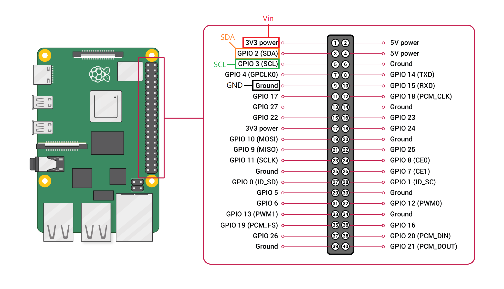
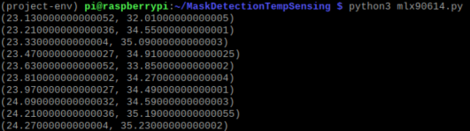
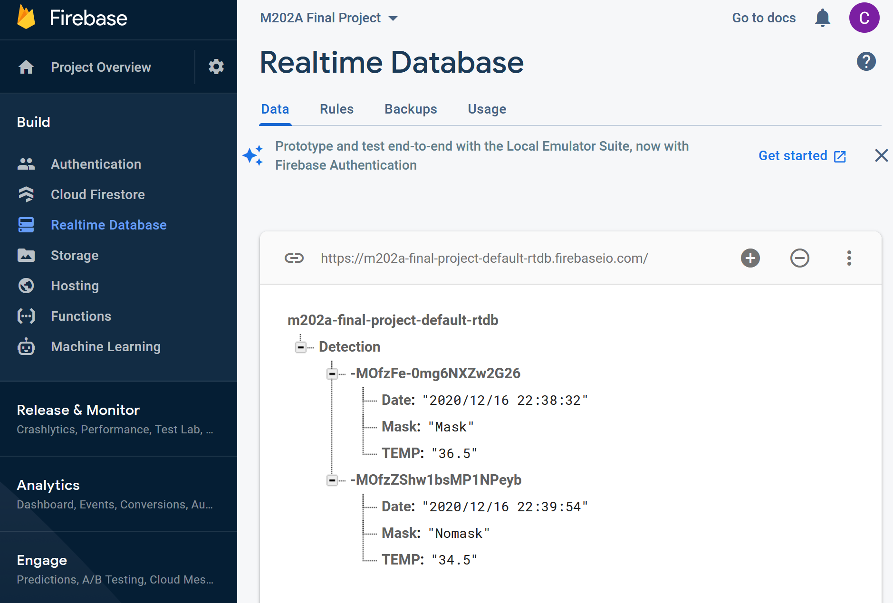
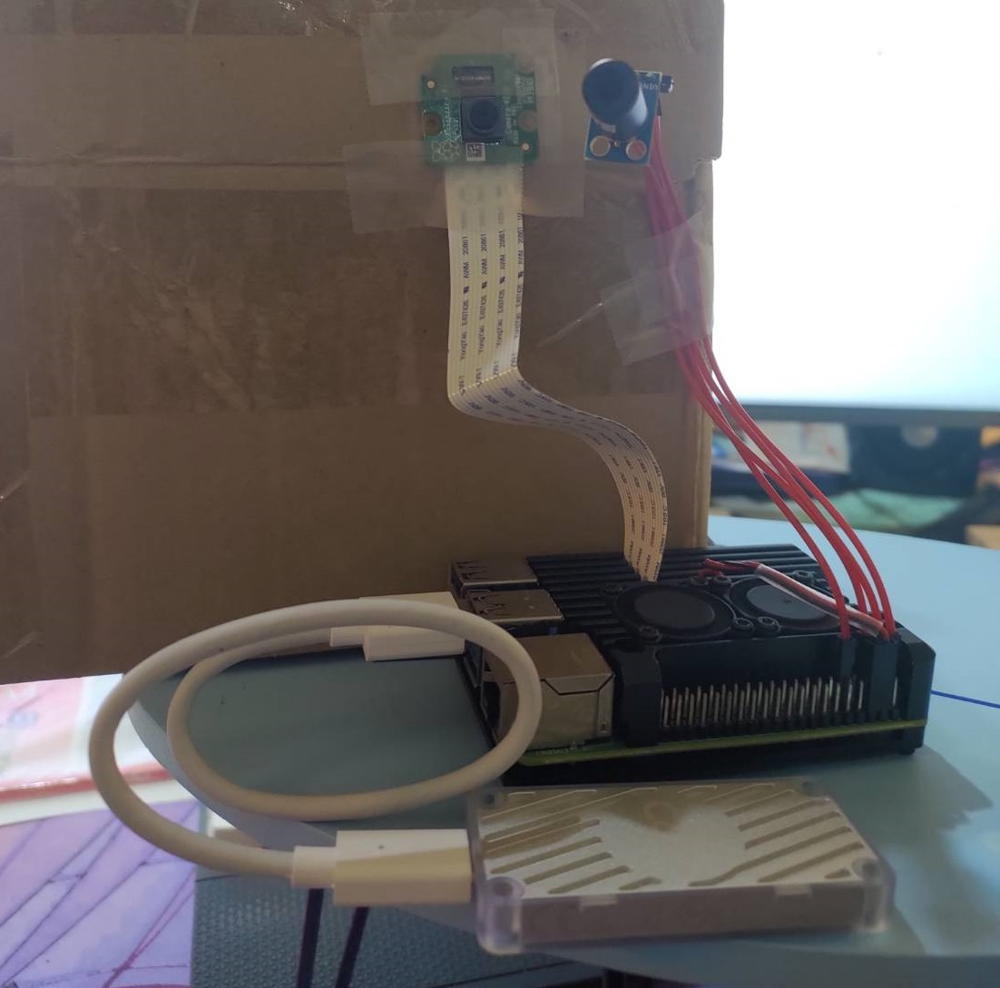

# Mask Detection with Body Temperature Sensing

## Team Member
* Cheng-Tse Lu

## Project Introduction
### Motivation  

Due to COVID-19 pandemic, there are more than 40 million confirmed cases, with 1 million people deaths attributed to the pandemic. COVID-19 spreads very easily through the air when an infected person or an asymptomatic infection breathes, coughs, talks, or sneezes. Centers for Disease Control and Prevention (CDC) recommends that “people wear masks in public settings, like on public and mass transportation, at events and gatherings, and anywhere they will be around other people” and “masks may help prevent people who have COVID-19 from spreading the virus to others.” Therefore, having a system that can detect whether a person is wearing a mask and also measuring his/her body temperature at the same time could keep tracking people's health; furthermore, reduce the risk of being infected.

### Goal  

Incorporate deep learning algorithm for mask detection and use the sensor to measure body temperature. Also, sort the data in cloud.

### Deliverable  

Instead of using thermography camera for long range and multiple detections, I use small thermal sensor with edge AI computing to achieve the goal.

## Hardware Used in This Project
* Raspberry Pi 4 Model B (4GB RAM)
* Raspberry Pi camera v2.1
* GY-MLX90614-DCI
* Google Coral (Edge TPU)

## Installation on Raspberry Pi
* Download the github project

        git clone https://github.com/ChengTseLu/MaskDetectionTempSensing.git
        cd MaskDetectionTempSensing
        
* Install python virtual environment

        sudo apt-get install python-virtualenv
        pip3 install virtualenv
        
* Create python virtual environment (check your python version)
        
        python3.7 -m venv project-env
        
* Activate python virtual environment (activate everytime when open new terminal)

        source project-env/bin/activate
        
* Install packages
        
        bash get_pi_requirements.sh
        pip3 install adafruit-circuitpython-mlx90614
        pip3 install requests
        pip3 install https://github.com/google-coral/pycoral/releases/download/release-frogfish/tflite_runtime-2.5.0-cp37-cp37m-linux_armv7l.whl
        
* Install Google Coral Library

        echo "deb https://packages.cloud.google.com/apt coral-edgetpu-stable main" | sudo tee /etc/apt/sources.list.d/coral-edgetpu.list
        curl https://packages.cloud.google.com/apt/doc/apt-key.gpg | sudo apt-key add -
        sudo apt-get update
        sudo apt-get install libedgetpu1-std

* If error indicates no module named 'cv2', delete the project-env folder, deactivate the virtual environment and reinstall the packages again (try couple times)

## Part 1: Mask Detection Algorithm

### Training Tool
I use [Google Object Detection API](https://github.com/tensorflow/models) for training deep neural network. It provides more than 20 different models including SSD, Faster RCNN, Mask RCNN to choose except YOLO. Also, most of the models are trained under COCO dataset and evaluated under the same environment ([speed vs accuracy](https://github.com/tensorflow/models/blob/master/research/object_detection/g3doc/tf1_detection_zoo.md)), so we can have better understanding of the performance of models.

### Algorithm Selection
* Fast: need to be real-time detection on raspberry pi so that the processor can have time handle other tasks
* Small Size: able to run on raspberry pi since we only have 4GB RAM
* Tensorflow Lite Compatible: a lightweight library designs for edge devices to deploy models (Note: Tensorflow Lite does not support RCNN models, only SSD models) 
  
After evaluating models under this three criterias, I select ssd mobilenet v2 quantized model for my Mask Detection Algorithm (quantizing the model from FP32 (float) to INT8 (int) increase the speed and reduce the model size; however, the accuracy would also slightly decrease)

### Dataset
I use an open source [dataset](https://github.com/AIZOOTech/FaceMaskDetection) which contain 7959 images and bounding boxes of both mask and nomask. According to their description, "the dataset is composed of WIDER Face and MAFA, and we verified some wrong annotations." The file can be downloaded through [google drive](https://drive.google.com/file/d/1QspxOJMDf_rAWVV7AU_Nc0rjo1_EPEDW/view) (763Mb)

### Training Steps 
* Step 1: Generating TFRecords from dataset
* Step 2: Configuring training
* Step 3: Training model
* Step 4: Freeze model to .tflite
* Step 5: Convert .tflite to Edge TPU compatible model
  
More details about training steps can be found online ([offical doc](https://github.com/tensorflow/models/blob/master/research/object_detection/g3doc/tf1_training_and_evaluation.md))  
More details about freezing model to .tflite ([offical doc](https://github.com/tensorflow/models/blob/master/research/object_detection/g3doc/running_on_mobile_tensorflowlite.md))  
More details about converting to edge tpu compatible model ([offical doc](https://coral.ai/docs/edgetpu/compiler/#system-requirements))

### Raspberry Pi Implement
The mask detection model is trained and uploaded in the mask_detection folder  
Run a simple test using following command (make sure Raspberry Pi camera is installed)  

        python3 TFlite.py
        
Press Q to exit the code

## Part 2: Body Temperature Sensing

[GY-MLX90614-DCI](https://www.digchip.com/datasheets/parts/datasheet/287/MLX90614ESF-DCI-000-SP-pdf.php) has a high precision contactless temperature measurement. The sensor can detect object temperature from -70 to +380 C range with a 0.02 C resolution. The maximum distance measued can go up to 50 cm, and the ideal distance to measure body temperature is within 15 cm.

### Raspberry Pi GPIO Connection

### Test Code
adafruit_mlx90614 library is necessary for running temperature measuring code

        python3 mlx90614.py
        
### Result From Test Code

## Part 3: Cloud Storage

I choose Google Firebase database to store the detection results and temperature data. Google Firebase allows people to store and sync data between users in realtime. Data in Google Firebase is stored as JSON files, and people are able to define their own data structure.

### Data Structure
* Date: Year/Month/Date hr:min:sec
* Mask: Mask or Nomask
* TEMP: temperature  

### Test Code
Run the following command to test Google Firebase service. Modify the url to your own project link

        python3 cloud.py
        
### Results from Test Code

## Final: Combining 3 Parts
Lastly, I combine all three parts above together for final demo. I also create a simply GUI to show the mask detection and temperature results together. The data would be stored in cloud if the person stays in front of the camera for 1 to 2 sec. The resolution of the video is set to be 600 x 600.

### Test Code
* Without Google Coral 

        python3 main.py

* With Google Coral  

        python3 main.py --edgetpu

### Demo

* Hardware Setup

* Without Google Coral (click the image to watch video)  

* With Google Coral (click the image to watch video)  

## Conclusion and Future Directions
To sum up, I successfully implement a edge computing system that can detect masks, sense body temperature without contacting, and store detection data to cloud service. As the demos show, average fps without using Google Coral is about 4.2; however, average fps using Google Coral is roughly 50 which is 12 times faster, and it is amazing to see such achievement on an edge device (the result may be different using USB 2.0 instead of using USB 3.0). Although the thermal sensor is able to do contactless body temperature measurement, the ideal distance to mearsure body temperature is quite short. In the future, I may use thermal imaging camera to get more precise temperature measurement for longer distance, and the imaging data can combined with mask detection algorithm to get a more accurate detection result. Lastly, mask detection and temperature data are able to store to cloud service realtime, but I also want to implement storing the cropped picture of the person with or without mask to the cloud in future.

### Strengths
* Fast and Accurate deep learning algorithm
* Contactless temperature measurement
* Realtime data storage to cloud

### Weaknes
* Short temperature measurement range

### Final Presentation Slide

## References
* [Data Sets](https://github.com/AIZOOTech/FaceMaskDetection)
* [Google Object Detection Api](https://github.com/tensorflow/models)
* [Raspberry Pi Tensorflow Lite Setup](https://github.com/EdjeElectronics/TensorFlow-Lite-Object-Detection-on-Android-and-Raspberry-Pi)
